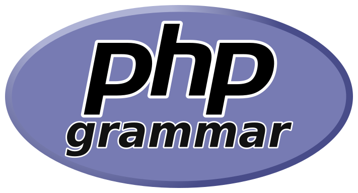

<p align="center">
  
</p>

Versioned EBNF grammars and human-readable specifications for the PHP language syntax.

php-grammar maintains standalone, source-backed grammars for PHP major/minor releases, accompanied by matching Markdown documentation. PHP 8.5 is under active conformance audit; see [remaining discrepancies](docs/php85-audit-remediation.md).

PHP 8.5 Grammar Completeness Phase 4 adds systematic negative-boundary evidence:
250 structural-negative and 22 contextual-negative fixtures, each paired with
a nearby valid repair. The corpus contains 497 valid, 335 structural-negative,
and 85 contextual-negative files across both short-tag profiles. PHP 8.5.10
differential validation reports zero unexpected mismatches; two known
discarded-closure discrepancies remain. Full PHP 8.5 conformance is not established.

Positive coverage remains 303/366 productions (82.8%) and 609/794 alternatives
(76.7%). Rejection evidence has a separate [boundary ledger](docs/php85-negative-boundaries.md),
with 14 boundary categories and no misleading rejection percentage. See the
[Phase 4 report](docs/php85-phase4-negative-coverage.md),
[Phase 3 evidence](docs/php85-phase3-coverage.md), and
[generated positive witnesses](docs/php85-phase3-coverage.json).

## Purpose

PHP syntax is often described through a mix of parser implementation files, manual pages, RFCs, migration guides, examples, and third-party grammars. This project brings those pieces together into a maintained grammar reference with two goals:

- provide canonical `.ebnf` grammar files for specific PHP language versions;
- provide corresponding `.md` documentation that explains the same syntax in human-readable form.

The EBNF is the authoritative artifact. Markdown documentation may add explanation, examples, and source notes, but it must not describe syntax that is absent from the canonical EBNF.

## Uses

This repository can support projects that need a clear PHP syntax reference, including:

- parser and lexer research;
- syntax highlighters and editor tooling;
- static analysis tooling;
- code formatters and refactoring tools;
- documentation generators;
- language compatibility checks;
- grammar comparisons across PHP versions;
- educational material about PHP language syntax.

The grammar describes syntax, not runtime behavior. It does not attempt to define PHP semantics, type checking, standard library behavior, framework conventions, or coding style rules.

## Repository Layout

The intended project layout is:

```text
grammar/
  8.5/
    php.ebnf
    php.md

docs/
  conformance.md
  grammar-conventions.md
  sources.md
  versioning.md

src/
  Ebnf/
    Lexer.php
    Parser.php
    Matching/
    Validation/
  Php/
    Conformance/
    Lexing/

tests/
  fixtures/
    ebnf/
    php/
      <version>/
        valid/
        invalid/
```

## Versioning Model

Grammar versions correspond to PHP major/minor language releases and are
declared in `php-grammar.json`. The current manifest includes:

```text
grammar/8.5/php.ebnf
```

Patch releases such as `8.5.1` or `8.5.2` do not normally receive separate grammar directories. A patch-specific grammar should only be introduced when PHP syntax materially differs between patch releases and that difference is verified against authoritative sources.

Repository releases are independent of PHP language versions. A project release such as `v0.2.0` may contain new grammar versions, corrections to existing grammars, documentation updates, tooling changes, or tests.

See [docs/versioning.md](docs/versioning.md) for the full policy.

## Grammar Conventions

Canonical grammar files use a small ISO-style EBNF subset. The notation is designed to be readable, deterministic, and implementation-neutral.

Example:

```ebnf
argument-list =
    "(" ,
    [ argument , { "," , argument } ] ,
    ")" ;
```

The grammar avoids parser-generator-specific syntax, semantic actions, and implementation-only token names unless they are required to accurately describe PHP source text.

See [docs/grammar-conventions.md](docs/grammar-conventions.md) for the full notation and style guide.

## Sources and Evidence

Grammar changes should be traceable to authoritative PHP language sources. Preferred sources include:

- PHP parser and lexer source for the relevant PHP version;
- accepted PHP RFCs;
- official PHP documentation;
- official PHP migration and release documentation;
- PHP parser and language tests.

When sources disagree, the discrepancy should be investigated and documented instead of guessed around.

See [docs/sources.md](docs/sources.md) for the full source policy.

## Contributing

Contributions should preserve the core project rule: describe PHP syntax accurately, do not redesign it.

For grammar changes:

1. identify the affected PHP version;
2. verify the syntax against authoritative sources;
3. update the canonical `php.ebnf`;
4. update the corresponding `php.md`;
5. add or update focused valid and invalid fixtures where practical;
6. run available validation and tests;
7. document material source evidence.

Each versioned grammar must remain complete and standalone. Do not implement a grammar version as an overlay, diff, include, or extension of another PHP version.

## Testing

The PHPUnit suite validates repository EBNF independently. A separate
differential command compares the same corpus with official PHP 8.5 lint:

```text
php bin/php85-conformance.php /path/to/php-8.5
```

Structural acceptance and contextual compilation constraints are reported
separately. The runner rejects binaries outside PHP 8.5.x.

Install dependencies and run the PHPUnit suite:

```bash
composer install
composer test
composer grammar:coverage
```

Phase 1 parses every `grammar/<version>/php.ebnf` file with the project's EBNF
parser and validates grammar integrity, including malformed EBNF, duplicate
productions, undefined references, unreachable productions, the required root
production, production naming, and unintended empty productions.

Phase 2 adds a reusable EBNF matcher. It evaluates parsed grammar productions
against input, supports complete-input matching from the root production, and
can match an explicitly selected production:

```php
use PhpGrammar\Ebnf\Matching\Matcher;
use PhpGrammar\Ebnf\Parser;

$grammar = (new Parser())->parse(file_get_contents('grammar/8.5/php.ebnf'));
$matcher = Matcher::withDefaultPrimitives();

$result = $matcher->matches($grammar, $input);
$operator = $matcher->matchesRule($grammar, 'object-operator', '->');
```

Phase 3 refactors the matcher around a generic input abstraction. `StringInput`
preserves the Phase 2 string behavior, and callers may still pass strings
directly to the matcher. Internally, matching consumes input elements through
`Input::length()` and `Input::valueAt()`, which keeps the EBNF layer reusable for
future token-based inputs.

The matcher supports the repository EBNF constructs: references, sequences,
alternatives, literals, groups, optionals, repetitions, intentional empty
constructs, and configured lexical primitives. It backtracks deterministically,
requires full input consumption for success, guards recursive evaluations, and
prevents zero-width repetition loops. Failed matches report the furthest input
offset and expected literals or productions where practical.

Phase 3 also adds a repository-owned PHP lexical layer under `Php\Lexing`.
It converts PHP source text into a `TokenStream` of project tokens without using
`token_get_all()`, `php -l`, the installed PHP parser, or subprocesses. Tokens
retain their type/category, exact lexeme, source offset, source length, line, and
column. The PHP 8.5 lexer currently covers identifiers, variables, keywords,
numeric literals, representative string forms, operators, punctuation,
whitespace, comments, doc comments, inline HTML, and PHP open/close tags.

`code-unit` is treated as a lexical primitive by validation and matching rather
than as an ordinary EBNF production. In this repository a code unit currently
means one raw source byte in the PHP source file. That matches PHP's byte-
oriented scanner model for low-level source text categories and avoids inventing
Unicode code point semantics that PHP's lexer does not impose. `StringInput`
therefore exposes one byte per input offset, and the default `code-unit`
primitive consumes one byte. A later source-encoding layer may add richer policy
without changing canonical grammar productions.

Phase 4 adds full PHP grammar conformance tests against the canonical EBNF:

```text
PHP source
  -> repository PHP lexer
  -> TokenStream
  -> PHP grammar input adapter
  -> generic EBNF matcher
  -> grammar/<version>/php.ebnf
```

The grammar-to-token contract is explicit:

- syntactic EBNF literals such as `"function"`, `"|"`, `"?>"`, and `"public"`
  match token lexemes;
- keywords are matched by their lexeme after the lexer classifies them as
  keyword tokens;
- punctuation and operators are matched by their exact lexeme;
- lexical productions such as `identifier`, `variable`, `integer-literal`,
  `floating-literal`, `string-literal`, `heredoc-string`, and
  `inline-html-text` are matched by PHP-specific token category primitives;
- whitespace, comments, and doc comments are trivia and are removed before
  syntactic grammar matching;
- raw `StringInput` and `code-unit` matching remain available for EBNF and
  lexical leaf tests, while full PHP source conformance uses token input.

Conformance fixtures live under:

```text
tests/fixtures/php/8.5/valid/
tests/fixtures/php/8.5/invalid/
```

Whole-file tests call `PhpGrammarMatcher::matches('8.5', $source)` from
`source-file`. Targeted rule-level tests call `matchesRule()` on PHP fragments;
for non-root rules, the conformance layer lexes fragments in PHP-code mode
without requiring each fragment to include an opening tag.

The structural suite checks focused positive and negative fixtures. The
differential suite additionally compares official PHP 8.5 compilation.
Documented contextual constraints form a mandatory third specification layer;
their implementation remains incomplete. Passing fixtures do not establish
exhaustive grammar equivalence or runtime validity.

PHP 8.5 audit remediation follows this conformance boundary: the canonical
grammar describes valid PHP 8.5 language syntax, not every intermediate form the
Zend parser can reduce before contextual validation. The PHP lexer and
conformance adapter now model PHP/HTML source-mode transitions explicitly,
including `<?php`, `<?=`, `?>`, inline HTML, close tags as statement
terminators, and configuration-dependent short open tags. Lexical primitives
distinguish ordinary identifiers from contextual name keywords, validate numeric
literal subclasses by lexeme, and keep `code-unit` as the byte-oriented source
primitive for uninterpreted lexical regions.

The PHP 8.5 grammar has been tightened around expression precedence,
dereferenceability, argument lists, destructuring assignments, variable
variables, statement target restrictions, property hooks, typed class constants,
trait adaptations, casts, nullable/DNF type syntax, and constant-expression
syntax. Restrictions that are not reasonably expressible in ordinary EBNF, such
as exact heredoc label equality, flexible heredoc indentation, duplicate
modifiers, impossible type combinations, and some compile-time contextual
checks, are documented as contextual constraints rather than treated as runtime
semantics.

See [docs/php85-audit-remediation.md](docs/php85-audit-remediation.md) for the
Phase 2 audit disposition checklist.

Grammar coverage reporting measures which EBNF productions and branches are
exercised by conformance inputs. It is separate from PHP code coverage. The
coverage command reports production coverage, alternative coverage, attempted
coverage from invalid fixtures, and explicit uncovered grammar-element lists.
Valid fixtures and selected rule-level samples count as successfully matched
coverage. Invalid fixtures count only as attempted coverage so rejected source
does not make valid syntax branches appear covered. Coverage percentages are
informational at this stage; no threshold is enforced.

For the Grammar Completeness Phase 3 workstream (distinct from the historical
implementation phases above), add small positive files for integration and
cases in `Php85CoverageCases` for individual alternatives. Production coverage
alone does not show whether a production's alternatives have been exercised.
Primitive successes are recorded separately from traversal of their EBNF bodies;
do not add artificial files to traverse token-internal lexical rules.
Positive coverage generation fails if a positive input is rejected.

For Grammar Completeness Phase 4, add minimal `invalid/phase4-*.php` or
`contextual-invalid/phase4-*.php` fixtures and matching `valid/phase4-*.php`
repairs. Record the production anchor, boundary category, classification, and
pinned source evidence in `docs/php85-negative-boundaries.json`. Update the
contextual review for every contextual-negative fixture. All ordinary fixtures
automatically participate in PHPUnit and differential lint. Constant-expression
and argument-order restrictions may be contextual even when they look structural:
PHP can discard an invalid operation before checking it. Follow the
[negative-boundary methodology](docs/php85-phase4-negative-coverage.md).

```text
php tools/php85-coverage-report.php
php tools/php85-coverage-report.php --check
php tools/php85-negative-report.php
php tools/php85-negative-report.php --check
```

The generated report links completed chart items to their first positive
fixture/rule witness, preserves the original backlog, and leaves newly uncovered
syntax visible as `meaningful-gap`. It does not prove unique parse derivations,
AST binding, full contextual validation, or runtime behavior.

See [docs/conformance.md](docs/conformance.md) for the conformance pipeline,
token contract, fixture layout, and coverage methodology.

Phase 5 adds repository-wide version package validation and version-boundary
test infrastructure. Supported grammar versions are declared in the repository
manifest:

```text
php-grammar.json
```

That manifest is the source of truth for:

- supported PHP grammar versions;
- the root production for each version;
- canonical EBNF and Markdown paths;
- conformance fixture paths;
- the PHP lexer configuration for each version;
- shared lexical primitives such as `code-unit`.

Every supported version package must include:

```text
grammar/<version>/php.ebnf
grammar/<version>/php.md
tests/fixtures/php/<version>/valid/
tests/fixtures/php/<version>/invalid/
```

Each version remains complete and standalone. The manifest declares available
packages; it does not introduce grammar inheritance, overlays, includes, or
diff-based versioning.

Version-boundary fixture infrastructure is available under:

```text
tests/fixtures/version-boundaries/
```

Boundary metadata can describe a syntax feature, its first supported version,
an optional last supported version, the source snippet or fixture path, and an
authoritative reference. With only PHP 8.5 currently present, no real
cross-version boundary fixtures are required; the framework handles a
single-version repository cleanly. When another grammar version is added,
boundary fixtures should verify introduced or removed syntax across the
manifest versions.

When adding a new PHP grammar version:

1. add `grammar/<version>/php.ebnf` and `grammar/<version>/php.md`;
2. add `tests/fixtures/php/<version>/valid/` and `invalid/` fixtures;
3. add or select the corresponding PHP lexer configuration;
4. add the version package to `php-grammar.json`;
5. add boundary fixtures for syntax introduced or removed across versions;
6. run `composer test`.

## License

This project is licensed under the MIT License. See [LICENSE](LICENSE).
